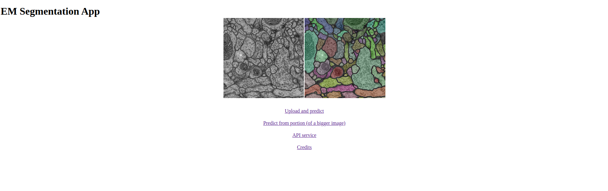
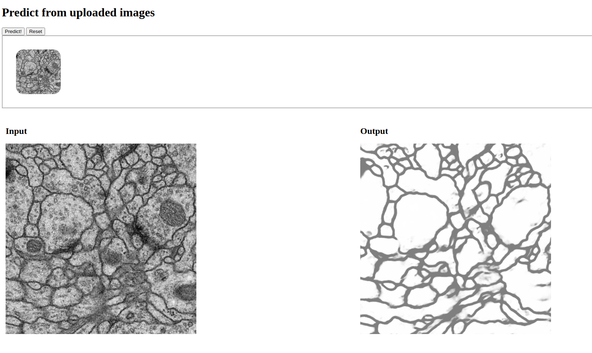
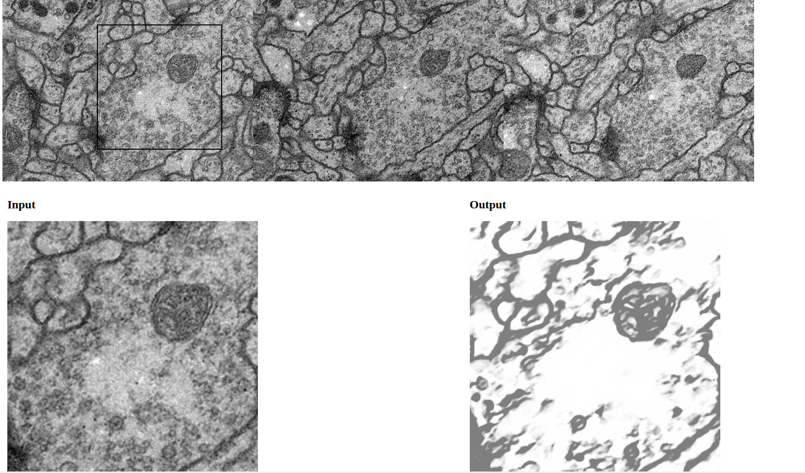

# cc-rest-imgsegm

## Conda environments

This project was initially put together ona M1 Macbook. Please, create a new environment base on the following .yml based on your machine's architecture:

* (ARM) (tf-silicon.yml)[https://drive.google.com/file/d/1nDPqkm4UjDsbs407gZGDxmEVeToegUQN/view?usp=sharing]
* (x86) (tf-linux.yml)[https://drive.google.com/file/d/1x28FEAa2WL3qRQsBAEW5QRszf7eydgPz/view?usp=sharing]

```
# create the env
conda env create -f tf-xxxxx.yml

# check the env
conda env list

# activate the environment
conda activate tf-xxxxx
```

It is suggested to open to separate terminal tabs, one to run the Webapp (make sure you run the steps below first) and the other for the Server (where real-time logs will be shown). TOP

## Webapp



Strongly suggested to use http-server (npm package) to have a local server which enables to work with the webapp (HTML/JS). 

If you don't have node installed on your system, please, use (nvm)[xxx] and install

```
# install node LTS
nvm install --lts 

# globally install http-server
npm install -g http-server

# run the webapp
cd webapp 
http-server -o .
``` 

### Upload and Predict



You may 

### Predict from portion (of a bigger image)



You may use your mouse to move around with a squared pointer to select a portion of a dummy large biomedical image of a nerve. On click, the webapp will extract the selected canvas and it'll send the request to the server to obtain a prediction. That prediction will be displayed to the user in a few seconds.

### API Service

Tools like cURL may be used to perform requests programmatically. The feature is work in progress. Here's the list of the available endpoint:

*Request*
```
URL: http://0.0.0.0:5000/from_mat

Type: POST

Headers: Content-type: application/json;charset=UTF-8

Body:


{
    // Gray-scaled 512x512 image(s)
    "images": [
        [...],
    ],

    // To inform the server we deal with 0-255 values and not 0-1
    "normalized": false
}
```                

*Response*
```
The server will answer back with a JSON containing name of the image(s) in the form of a UUID
along with the input/output URL.
A .mat generated file representing the image sent during
the request whilst the output will contain a URL to actually see the prediction.

Data (with code 200):


{
    "e0af4fcc-2c90-4629-bf08-3baa1d089ed8": {
        "input": "http://0.0.0.0:5000/tmp/2021-08-19_19-21-29/9c85b19c-a8d2-4be0-819f-9cdfa57f4f79.mat",
        "output": "http://0.0.0.0:5000/tmp/2021-08-19_19-21-29/preds/e0af4fcc-2c90-4629-bf08-3baa1d089ed8.png"
    }
}
```

#### Sample Request/Response

*Request*
```
TYPE: 		POST
URL:  		"http://127.0.0.1:5000/from_mat"
HEADERS: 	"Content-type: application/json;charset=UTF-8"
BODY:
{
	"images": [
		[144,145,148,148,145,134, ... ,116,99,90]
	],
	"normalized":false
}
```

*Response*
```
{
	"e0af4fcc-2c90-4629-bf08-3baa1d089ed8": {
		"input": "http://0.0.0.0:5000/tmp/2021-08-19_19-21-29/9c85b19c-a8d2-4be0-819f-9cdfa57f4f79.mat",
		"output": "http://0.0.0.0:5000/tmp/2021-08-19_19-21-29/preds/e0af4fcc-2c90-4629-bf08-3baa1d089ed8.png"
	}
}
```

## Server

You may want to be sure to have a separate tab opened and with the correct conda environment activated, before proceeding with this.

To startup the serverm, run the following command:

```
python server.py
```

### Model


The Image Segmentation model comes from [this repo](https://github.com/legentz/nn4ds-2020). The model was extracted and put behind a Flash server. Simple as that (...and ugly).

#### Weights

The model comes pre-trained. You may want download the pre_trained.zip [here](https://drive.google.com/file/d/1MDLmPo56c6ILg7SVJqaDsEq00FYoIWHY/view?usp=sharing). Zip files are ignored, so you could place it into the _server/weights_ folder and unzip it without the need of removing it.

#### Playground

The service comes from another project [NN4DS](https://github.com/legentz/nn4ds-2020). You might find the jupyter notebook file useful to deal with experiments, debug/re-train the model and so on. However, _it is not necessary for the sake of the CC project._ 

## Docker

Use the following commands to build and run docker containers for server and webapp.<br>
**Make sure to be into the docker folder (...cc-rest-imgsegm/docker) when running build command.**<br>

**You can run build command from project's root path, but you must add ```docker/``` to dockerfiles path<br> and replace build’s context path with```.``` instead of ```../```**
### Build & Run Server

Build _(takes some time)_:
```
docker build -t server/conda-debian:v1.0 --file server.Dockerfile ../ 
```

Run _(no need to be in docker folder path when running)_:
```
docker run -p 5000:5000 server/conda-debian:v1.0 
```

**OPTIONAL**: Add ```-d``` to run container in background<br>
**OPTIONAL**: Add ```--name``` to assign a name to container


### Build & Run Webapp

Build:
```
docker build --rm -t webapp/nginx-alpine:v1.0 --file webapp.Dockerfile ../ 
```

Run _(no need to be in docker folder path when running)_:
```
docker run -p 80:80 webapp/nginx-alpine:v1.0 
```

**OPTIONAL**: Add ```-d``` to run container in background<br>
**OPTIONAL**: Add ```--name``` to assign a name to container


### Clean Up
To remove all dangling images
```
docker image prune
```
Add ```-a``` to remove all images not referenced by any container